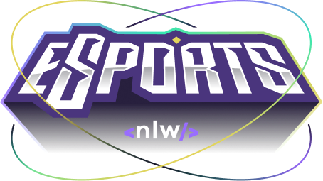
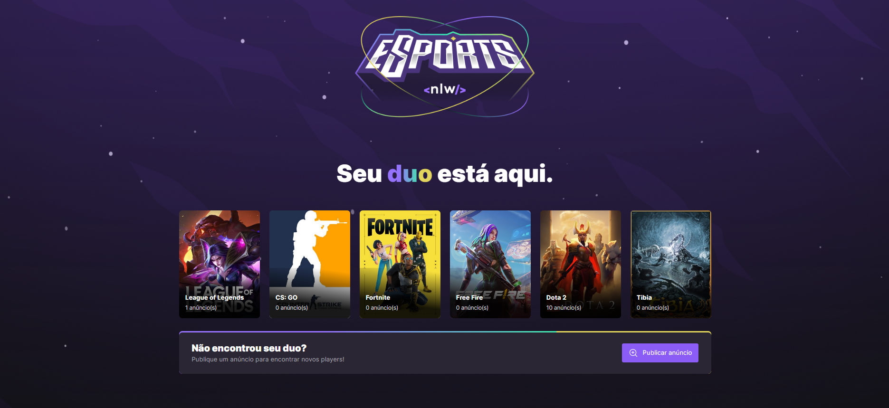
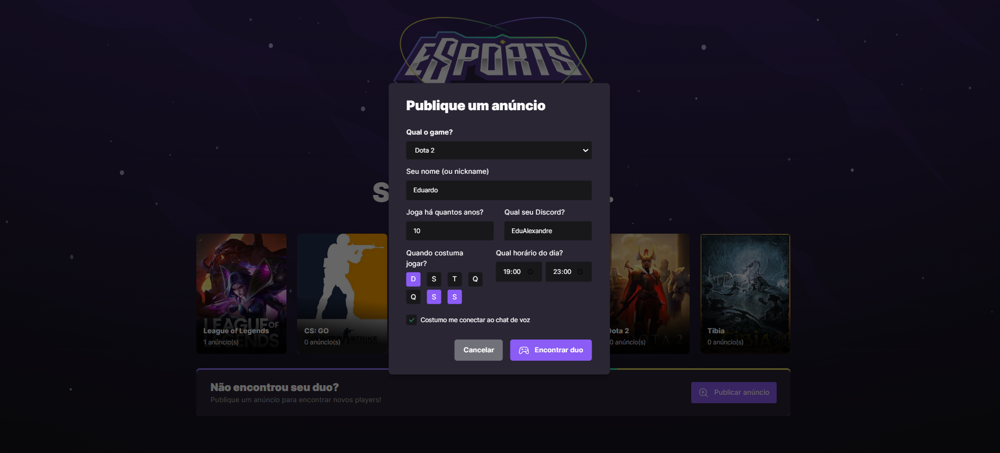

<a id='ancora'></a>


<div align="center">

</div>

<br><br>

# NLW eSports RocketSeat - Trilha Ignite 🚀

<br><br>

- [Sobre a RocketSeat](#ancora1) <br>
- [Sobre o Evento NLW](#ancora2) <br>
- [Sobre o Projeto - Trilha Ignite](#ancora3) <br>
- [Competências Desenvolvidas](#ancora4) <br>
- [Execução](#ancora7) <br>
- [Prints de Execução](#ancora8) <br>
- [Desenvolvimento](#ancora9)

<br><br>


<a id="ancora1"></a>
## Sobre a RocketSeat 🚀

<br>

A Rocketseat surgiu para ser um filtro para todas essas informações e te guiar indo direto ao ponto no que importa. Somando tecnologias alinhadas com o mercado a uma jornada completa de aprendizado. É uma plataforma de educação em tecnologia onde você encontra tudo o que precisa para progredir na programação e alcançar seus objetivos no menor tempo possível.

<br>

<a id="ancora2"></a>
## Sobre o Evento NLW 👨🏽‍💻

<br>

NLW (Next Level Week) é o maior evento online e gratuito de programação na prática com muito código, desafios, networking e um único objetivo: levar o participante para o próximo nível.

<br>

<a id="ancora3"></a>
## Sobre o Projeto - Trilha Ignite✔️

<br>

Se você já dominou os fundamentos da programação e quer levar suas habilidades para o próximo nível desenvolvendo uma aplicação completa, essa é a sua missão.
Aqui você você vai desenvolver a versão web do Find your Duo, uma plataforma que ajuda gamers a encontrar um parceiro ou parceira para jogar online seu game favorito, conectado a Twitch.

<br>

<a id="ancora4"></a>
## Competências Desenvolvidas 📝

<br>

<div align="left">
  
  
  
  
  
  
  
  
  
  
  
</div>

<br>

<a id="ancora7"></a>
## Execução 💻

<br>

Clone este repositório remoto em seu equipamento:
```
git clone git@github.com:DuAlexandre/nlw-esports-rocketseat.git
```
Navegue até a pasta criada:
```
cd nlw-esports-rocketseat
```
Navegue até a pasta server
```
cd server
```
Instale as dependências do node_modules
````
npm install
````
É possível verificar o banco de dados para inserção manual com o comando:
```
npx prisma studio
```
Inicie o servidor na porta 3000:
````
npm run dev
````
Execute um segundo terminal e retorne para a página principal:
````
cd ..
````
Navegue até a página web:
```
cd web
````
Instale as dependências do node_modules
````
npm install
````
Inicie o projeto:
````
npm run dev
````
No terminal acesse o link http gerado para acessar a página:

<br>


<br>

<a id="ancora8"></a>
## Prints de execução 📷

<br>



<br>



<br>

<a id="ancora9"></a>
## 🤝 Desenvolvimento


Projeto desenvolvido por:

<br>

<table align="center">
  <tr>
    </td>
    <td align="center">
      <a href="https://www.linkedin.com/in/eduardo-alexandre025/">
        <br>
        <sub>
          <b>Eduardo Alexandre</b>
        </sub>
      </a>
  </tr>
</table>

<br><br>

[Voltar ao Topo](#ancora)